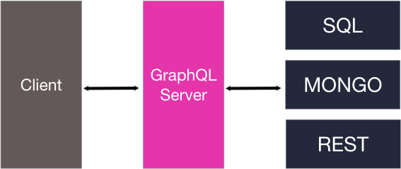

GraphQL ialah ```query language``` dan alternatif kepada ```REST API``` yang dibangunkan oleh Facebook. Pelayan GraphQL boleh dibangunkan dengan apa sahaja bahasa pengaturcaraan tiada bahasa pengaturcaraan yang spesifik untuknya. Kita juga boleh menggunakan apa sahaja sumber data seperti pangkalan data MySQL, MongoDB dan juga boleh menggunakan REST sebagai sumber data.



GraphQL dibangunkan oleh Facebook pada tahun 2012 dan digunakan pada peringkat dalam untuk beberapa aplikasi mudah alih mereka. GraphQL dilepaskan kepada umum pada tahun 2015 dan ianya juga sumber terbuka. GraphQL dibangunkan untuk menyelesaikan beberapa isu yang ada pada REST API. GraphQL mempunyai dua operasi iaitu ```Query``` dan ```Mutation``` kita akan mula dengan query terlebih dahulu.
