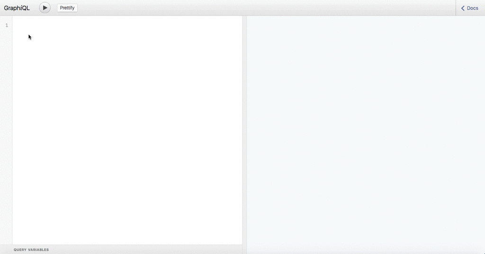

GraphQL query ialah perkara utama untuk GraphQL. Dalam langkah pertama ini kita akan belajar macam mana untuk menulis query asas pada ```GraphiQL```. Apa itu GraphiQL? Ya, [GraphiQL](https://github.com/graphql/graphiql) adalah GraphQL IDE yang dijalankan pada pelayar web dan terbina dengan documentation untuk pelayan GraphQL. Mari menulis query pertama kita pada pelayan GraphQL ini [[Link](http://belajargraphql.herokuapp.com)].

Dan jalankan query berikut:
```
{
  posts {
    title,
    content
  }
}
```



seperti biasa nampak bukan? GraphQL query seperti ```JSON``` tetapi tanpa nilai.

keputusan query:
```
{
  "data": {
    "posts": [
      {
        "title": "Tajuk 1",
        "content": "Beberapa perenggan."
      },
      {
        "title": "Tajuk 2",
        "content": "Beberapa perenggan."
      },
      {
        "title": "Tajuk 3",
        "content": "Beberapa perenggan."
      }
    ]
  }
}
```

GraphQL query akan mengembalikan data yang diminta sahaja tiada ```over‐fetching``` dan ```under‐fetching``` data berlaku.
