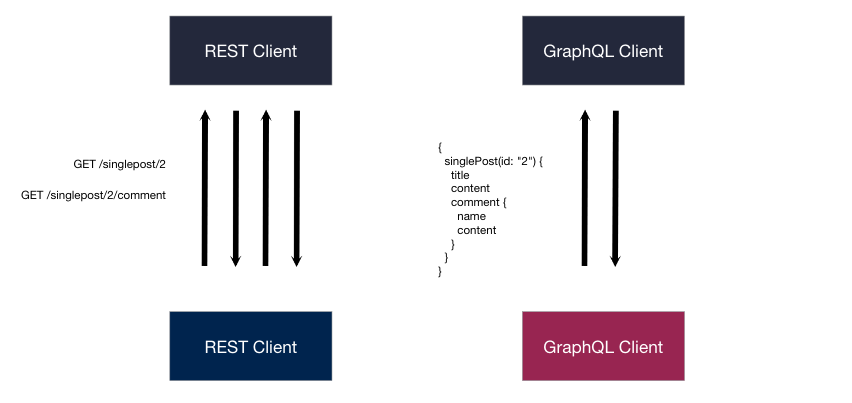

Kita juga boleh menjalankan ```nested query``` pada GraphQL. Sebagai contoh, dengan satu query kita dapat mengembalikan ```pos``` termasuk semua ```komen``` yang ada pada pos tersebut.

Jalankan query berikut:
```
{
  singlePost(id: "2") {
    title
    content
    comment {
      name
      content
    }
  }
}
```

 keputusan:

```
{
  "data": {
    "singlePost": {
      "title": "Tajuk 3",
      "content": "Beberapa perenggan.",
      "comment": [
        {
          "name": "Ahmad",
          "content": "komen 1"
        },
        {
          "name": "Siti",
          "content": "komen 2"
        }
      ]
    }
  }
}
```



Berbeza dengan pelayan REST ia memerlukan ```beberapa pusingan``` untuk mendapatkan data seperti ini, tetapi pada pelayan GraphQL ia hanya memerlukan ``` satu pusingan``` sahaja untuk mendapatkan kesemua data yang diminta. Ini memberi kelebihan kepada peranti mudah alih yang mempunyai keadaan rangkaian yang tidak begitu baik.
