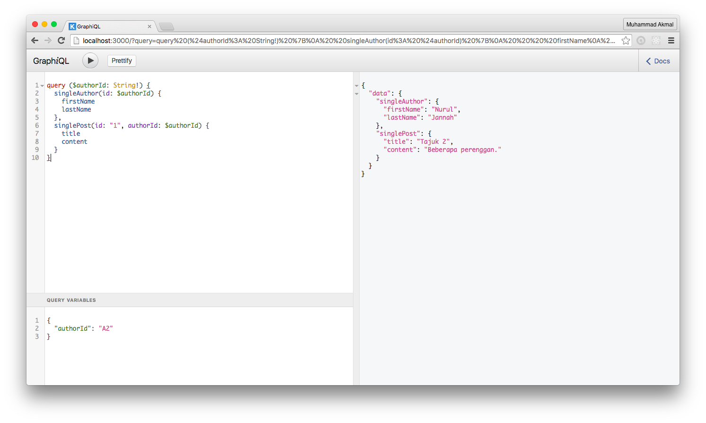

Dalam untuk mengurangkan ulangan pada query. Seperti situasi seperti ini:

```
{
  singleAuthor(id: "A2") {
    firstName
    lastName
  },
  singlePost(id: "1", authorId: "A2") {
    title
    content
  }
}
```
Kedua-dua operasi query menggunakan argument ```author_id``` yang sama. Ini lebih baik jika kita istihar ia pada satu pembolehubah.
Seperti berikut:
```
query ($authorId: String!) {
  singleAuthor(id: $authorId) {
    firstName
    lastName
  },
  singlePost(id: "1", authorId: $authorId) {
    title
    content
  }
}
```
Kita membuat pembolehubah ```$authorId``` dengan tanda dolar dihadapan dan ```String``` untuk jenis pembolehubah. Kemudian menetapkan pembolehubah dengan menambah JSON berikut pada tab ```QUERY VARIABLES``` pada GraphiQL.
```
{
  "authorId": "A2"
}
```


